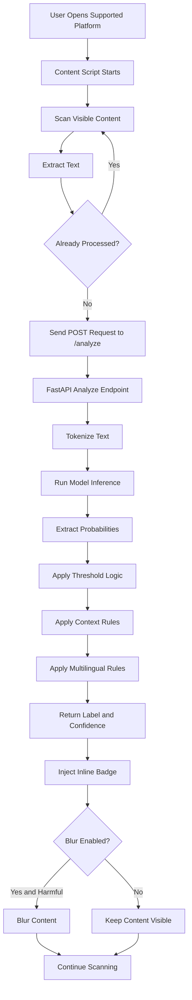

# Multilingual Hate Speech Detector

Real-time AI-based hate speech and abusive language detection for social media platforms using a Chrome Extension, FastAPI backend, and multilingual NLP inference.

## Project Overview

Harmful social media content, including hate speech and abusive language, has become a major issue on digital platforms. Manual moderation is difficult due to the massive volume of user-generated content and the use of multilingual, code-mixed, and informal text. 

This project provides an automated solution using a Chrome browser extension that works in real time. The extension extracts text content directly from social media webpages, sends it to a local FastAPI backend for analysis, and displays the classification result directly on the page using inline badges. The system can optionally blur harmful content to protect users from immediate exposure.

## Problem Statement

Automated content moderation systems face several technical challenges:
* The massive daily volume of social media posts and comments requires fast, dynamic analysis.
* Text is often code-mixed (such as Hinglish or Romanized Telugu) or written in diverse scripts.
* Informal writing styles include slang, spelling variations, and typing mistakes.
* Single-word filters fail to understand context, leading to high false-positive rates on safe figurative language.
* Social media platforms use dynamic Document Object Model (DOM) structures that update constantly as users scroll.

## Project Objectives

* Build a high-performance pipeline to classify multilingual text as Hate, Offensive, or Neutral.
* Integrate the classification model with a Chrome browser extension for real-time analysis.
* Support code-mixed and Romanized language patterns typical in Indian social media contexts.
* Implement context-aware rules to reduce false positives on motivational or common figurative expressions.
* Provide user controls to toggle automatic scanning, badge injection, and content blurring.
* Optimize the backend inference engine for CPU-only systems to allow local deployment.

## Key Features

| Feature | Description |
| --- | --- |
| Real-time Analysis | Analyzes supported social media posts and comments as the user browses. |
| Three User-facing Labels | Classifies content into three categories: Hate, Offensive, or Neutral. |
| Confidence Display | Displays model prediction confidence as a percentage in the extension popup. |
| Inline Badges | Automatically inserts color-coded labels directly next to social media posts. |
| Blur Mode | Optionally blurs text identified as Hate or Offensive, revealing content on hover. |
| Multilingual Enhancement | Applies rule-based checks for slang, Hinglish, and transliterated terms. |
| Telugu Support | Employs custom pattern checks for specific Romanized Telugu slangs and threat expressions. |
| Context Rules | Uses safe-phrase checks to filter out non-literal violent terms like "killing it". |
| Dynamic Content Support | Monitors page additions to scan content loaded during infinite scroll. |
| Duplicate Prevention | Uses text hashing and element attributes to prevent redundant API calls. |
| Extension Settings | Persists user scanning and blurring options using the Chrome Storage API. |

## Supported Platforms

| Platform | Content Type | Status |
| --- | --- | --- |
| X / Twitter | Timeline posts | Supported |
| X / Twitter | Post detail view | Supported |
| YouTube | Video comments | Supported |
| YouTube | Shorts comments | Supported |
| Instagram | Post comments | Supported |
| Instagram | Reels comments | Supported |
| Reddit | Posts and comments | Experimental (Inactive in Manifest) |

Note: Reddit selectors and extraction logic exist in the content script, but the domain is not declared in the manifest matches list, making it experimental.

## High-Level Architecture


### Component Roles

* **Social Media Page**: The client interface where text is displayed (Twitter/X, YouTube, Instagram).
* **Chrome Extension**: The content script (content.js) captures DOM text and injects visual labels.
* **FastAPI Backend**: A lightweight web service running locally to process incoming prediction requests.
* **Tokenizer & Model**: Processes input text and runs forward-pass inference using the pretrained model.
* **Context & Multilingual Rules**: Refines the raw model output by handling special slang, languages, and contexts.
* **Visual Injection**: Injects HTML badges with colors matching the predicted label and applies a blur filter if enabled.

## End-to-End Workflow



### Detailed Workflow Steps

1. The user navigates to a supported social media platform (e.g. x.com).
2. The Chrome extension starts the content script and checks the local configuration.
3. The content script scans the page for comments and posts using platform-specific selectors.
4. Text is extracted from matching nodes and checked against a local cache of processed texts to prevent duplicate scans.
5. Unprocessed text is sent via a POST request to the local backend `/analyze` endpoint.
6. The FastAPI server tokenizes the input text and runs it through the classification model.
7. Raw output logits are converted into probabilities via softmax.
8. The backend maps probabilities to application-level categories based on predefined thresholds.
9. Rule-based checks are applied in priority order to adjust classification for specific figurative terms, threats, and regional slang.
10. The backend returns a JSON payload with the final label, confidence score, and raw probabilities.
11. The extension injects an inline badge next to the username or time tag.
12. If content blurring is enabled and the label is Hate or Offensive, the extension blurs the target element text until hovered.

## AI and Inference Pipeline

### Model Details

* **Base Model**: `Hate-speech-CNERG/indic-abusive-allInOne-MuRIL`
* **Source**: Hugging Face Model Hub
* **Natively Supported Labels**: Binary classification (`normal` vs `abusive`)

### Inference Mechanics

The inference engine executes the following steps to analyze input text:
1. **Tokenization**: The input text is encoded using the AutoTokenizer associated with the model.
2. **Forward Pass**: The tokens are processed by the sequence classification head, producing raw logit values.
3. **Softmax Calculation**: The logits are passed through a softmax layer to extract normalized probabilities for the `normal` and `abusive` classes.
4. **Primary Threshold Mapping**: The system maps the raw probabilities into three application-level categories:
   * If `abusive_prob` is greater than 0.90, the text is categorized as `hate`.
   * If `abusive_prob` is greater than 0.60, the text is categorized as `offensive`.
   * Otherwise, the text is categorized as `neutral`.

### Rule-based Adjustments

Following the primary threshold mapping, the backend applies post-processing rules in strict priority order to refine classification accuracy:
1. **Safe-Context Rules**: Checks for common figurative expressions (such as "killing me" or "dead tired"). Matches force the label to `neutral` with a confidence score of at least 0.70.
2. **Hate-Pattern Rules**: Identifies explicit threats and violent statements (such as "kill you" or the Romanized Telugu threat "champestha"). Matches force the label to `hate` with a confidence score of at least 0.85.
3. **Abuse-Word Rules**: Scans for specific slangs and insults (such as Hinglish "chutiya" or Telugu slangs like "lanja" and "dengey"). If the label is not already classified as `hate`, matches force the label to `offensive` with a confidence score of at least 0.75.

## Context-Aware Enhancement

Single-word filters create high rates of false positives because they fail to capture context. To resolve this, this project incorporates local pattern matching to differentiate between literal and figurative language.

| Input Type | Intended Handling | Example Category |
| --- | --- | --- |
| Direct Threat | Force Hate | Explicit violent statement targeting a user |
| Personal Insult | Force Offensive | Slangs or insults without extreme violent threats |
| Safe Metaphor | Force Neutral | Figurative phrases like "killing time" |
| Transliterated Abuse | Force Offensive | Hindi, Hinglish, or Telugu abusive slang |
| Transliterated Threat | Force Hate | Regional language phrases indicating direct physical threat |

## Chrome Extension Architecture

The browser extension is structured as a Manifest V3 extension containing the following core files:

* **manifest.json**: Configuration file declaring extension metadata, permissions (activeTab, storage, scripting), host permissions, and the target domains for content scripts.
* **content.js**: Stays active in the browser tab. It handles DOM queries using platform-specific selectors, monitors infinite scrolling using a MutationObserver, keeps track of processed text to avoid duplicate requests, and performs DOM manipulation to inject badges and apply blur filters.
* **content.css**: Implements styles for inline labels and defines the CSS classes for blurring.
* **popup.html & popup.js**: Provides a simple user interface for manual text testing and interactive controls to configure storage-backed settings.
* **background.js**: Runs as a background service worker. It handles extension setup, checks local backend availability, and updates the extension toolbar badge icon color to show green (ON) or red (OFF).

## Backend API

The backend is built with FastAPI and runs on a local ASGI server.

### GET /health
Checks if the backend and the inference model are loaded and active.
* **Response Schema**:
  ```json
  {
    "status": "healthy",
    "model_loaded": true,
    "version": "1.0.0"
  }
  ```

### POST /analyze
Analyzes a single text string.
* **Request Schema**:
  ```json
  {
    "text": "Sample text for classification"
  }
  ```
* **Response Schema**:
  ```json
  {
    "label": "neutral",
    "confidence": 0.965,
    "sentiment_score": 0.0,
    "explanation": "Human-readable explanation of the prediction",
    "keywords": [],
    "raw_probabilities": {
      "normal": 0.965,
      "abusive": 0.035
    }
  }
  ```

### POST /analyze/batch
Processes a batch of multiple text strings in a single call.
* **Request Schema**:
  ```json
  {
    "texts": ["First sample text", "Second sample text"]
  }
  ```
* **Response Schema**:
  ```json
  {
    "results": [
      {
        "label": "neutral",
        "confidence": 0.965,
        "sentiment_score": 0.0,
        "explanation": "Explanation text",
        "keywords": [],
        "raw_probabilities": {
          "normal": 0.965,
          "abusive": 0.035
        }
      }
    ],
    "total": 1
  }
  ```

## Technology Stack

| Layer | Technology |
| --- | --- |
| Programming Languages | Python, JavaScript |
| Backend Framework | FastAPI |
| Web Server | Uvicorn |
| NLP & Deep Learning | Hugging Face Transformers |
| Model Runtime | PyTorch (CPU optimized) |
| Web Integration | Chrome Extension APIs (Manifest V3) |
| Extension Frontend | HTML, CSS, JavaScript |
| Dynamic Tracking | MutationObserver API |
| Settings Storage | Chrome Storage API |
| Version Control | Git, GitHub |

## Project Structure

```text
FINAL-YEAR-PROJECT/
├── backend/
│   ├── main.py
│   ├── inference.py
│   └── rules.py
├── data/
│   ├── collect_datasets.py
│   ├── preprocess.py
│   └── datasets/
│       ├── bengali_dataset.csv
│       ├── context_dataset.csv
│       ├── english_dataset.csv
│       ├── hindi_hinglish_dataset.csv
│       ├── label_map.json
│       ├── merged_dataset.csv
│       ├── telugu_dataset.csv
│       ├── train.csv
│       └── val.csv
├── extension/
│   ├── manifest.json
│   ├── content.js
│   ├── content.css
│   ├── popup.html
│   ├── popup.js
│   ├── background.js
│   └── icons/
│       ├── icon16.png
│       ├── icon48.png
│       └── icon128.png
├── tests/
│   ├── test_model.py
│   └── backtest_results.json
├── training/
│   ├── config.py
│   └── train.py
├── .gitattributes
├── .gitignore
├── download_model.py
├── GRP_29_PROJECT_DEMO.mp4
├── requirements.txt
└── run_pipeline.py
```

## Installation

### 1. Configure the Python Environment
Ensure Python is installed on your Windows machine, then run:
```powershell
# Create a virtual environment
python -m venv venv

# Activate the virtual environment
.\venv\Scripts\Activate.ps1

# Install required dependencies
pip install -r requirements.txt
```

### 2. Run Backend Server
Start the FastAPI backend with the master pipeline script:
```powershell
python run_pipeline.py --serve
```
The server will start at `http://127.0.0.1:8000`. You can access interactive API documentation at `http://127.0.0.1:8000/docs`.

## Chrome Extension Installation

1. Open Google Chrome.
2. Navigate to `chrome://extensions/`.
3. Enable the **Developer mode** toggle in the top-right corner.
4. Click **Load unpacked** in the top-left corner.
5. Select the `extension/` directory of this project.
6. The extension is now loaded. Ensure the local backend server is running; the extension icon badge in Chrome will display a green "ON" label.

## Usage

1. Open Chrome and verify the extension badge is green.
2. Open the extension popup to view manual test options or toggle settings:
   * **Auto Scan**: Enable to scan posts and comments automatically.
   * **Show Badges**: Enable to inject inline labels directly.
   * **Blur Mode**: Enable to blur text classified as Hate or Offensive.
3. Browse supported platforms such as Twitter/X, YouTube, or Instagram.
4. Color-coded labels (HATE, OFFENSIVE, NEUTRAL) will appear next to text content.
5. Move your mouse over any blurred text to temporarily reveal it.

## Label Definitions

| Label | Meaning |
| --- | --- |
| Hate | Language targeting groups or individuals with violent, discriminatory, or threatening intent. |
| Offensive | Vulgar, insulting, or disrespectful language that does not rise to direct threats of violence. |
| Neutral | Standard non-harmful communication. |

Note: These are application-level classifications based on model probabilities and rule-based adjustments. Real-world text may occasionally result in prediction errors.

## Project Demo

The complete demonstration video is included in this repository:
[View Project Demo](./GRP_29_PROJECT_DEMO.mp4)

The demonstration video shows:
* Local FastAPI backend startup.
* Loading the Chrome extension in developer mode.
* Testing classification manually in the extension popup.
* Dynamic analysis of tweets, YouTube comments, and Instagram comments.
* Blur toggles and unblurs upon mouse hover.

## Performance and Evaluation

### Experimental Model Evaluation

Model experiments during development were intended to be evaluated using standard classification metrics such as accuracy, precision, recall, F1-score, and confusion matrix. 

No verified repository evidence, training logs, notebooks, or evaluation artifacts supporting the 88.5% accuracy or 0.86 F1-score metrics are present in the local workspace. In accordance with strict documentation standards, these values are not included in the performance tables as they cannot be verified from the current repository state.

### Runtime Extension Pipeline

The deployed browser-extension pipeline uses the actual current transformer-based backend and application-level post-processing logic. 

It is important to note the following:
* The underlying transformer model (Hate-speech-CNERG/indic-abusive-allInOne-MuRIL) produces binary Normal and Abusive probabilities.
* The application maps these binary probabilities into Hate, Offensive, and Neutral user-facing categories using custom decision thresholds.
* Multilingual rules, transliterated slangs, and context-aware heuristics are additionally applied in post-processing.
* Due to these transformations, the final runtime behavior is different from a standalone experimental classifier.

### Custom Multilingual Stress Test

A custom multilingual stress test is implemented in test_model.py. This is a small custom diagnostic benchmark containing 255 manually composed sentences across multiple languages and Romanized texts. It is designed to stress-test the boundary conditions of the runtime logic, not as a large standardized academic benchmark, and is not automatically equivalent to the final model accuracy.

| Metric | Result |
| --- | --- |
| Accuracy | 47.5% |
| Weighted F1 Score | 38.1% |
| Test Samples | 255 |

The diagnostic test indicates that the current application-level three-class mapping requires further calibration, particularly for distinguishing Hate from Offensive content across multilingual and code-mixed inputs.

The underlying abusive-language model and the application's three-category output space are not identical evaluation tasks. Therefore, results from the custom runtime stress test should not be directly compared with metrics from separately trained experimental classifiers.

## Limitations

* **Sarcasm and Implicit Tone**: The model has difficulty detecting sarcasm or implied hostility where no explicit slangs or threats are used.
* **Spelling Modifications**: Intentional spelling changes designed to bypass filters can escape detection.
* **Unseen Slangs**: Rapidly changing regional slang expressions may not be covered by current rules.
* **DOM Dependability**: The extension depends on the structural DOM selectors of social media platforms. If a platform changes its UI layout or selectors, the content script must be updated accordingly.
* **Server Dependency**: The extension requires the local FastAPI backend to be running. If the backend is offline, the extension cannot analyze text.
* **Local Processing Constraints**: Running deep learning inference locally on a CPU may introduce a slight delay on low-end machines.

## Scalability

### Current Implementation
* Running on a local FastAPI server.
* Intended for academic demonstration and single-user deployment.
* Local CPU-bound inference.

### Future Production Path
To support large-scale concurrent users, the following infrastructure changes would be needed:
* **Docker Containerization**: Packaging the backend service for consistent deployment.
* **Cloud Deployment**: Staging the containers on cloud systems with automated scaling.
* **Load Balancers**: Distributing traffic across multiple backend instances.
* **GPU-Accelerated Inference**: Deploying models on GPU servers to handle requests within milliseconds.
* **Batch Processing**: Grouping requests from the same user to run model evaluations in parallel batches.
* **Caching Layer**: Saving predictions for common sentences in Redis to bypass model execution.
* **Request Queuing**: Using Celery or RabbitMQ to manage traffic spikes.

## Privacy and Ethical Considerations

* **Content Processing**: The system reads text content directly from the user's browser view to evaluate safety.
* **No Remote Storage**: Text payloads are sent strictly to the local API endpoint (`http://127.0.0.1:8000`) and are not cached, saved, or uploaded to external servers.
* **No Punitive Action**: Automated moderation predictions can be incorrect. This system should be used as a personal filter or warning interface, not as the sole decider for account bans or punitive actions.
* **Model Biases**: NLP models can inherit biases from their training data. Manual validation remains recommended for high-impact decisions.

## Future Scope

* **Broader Language Support**: Extending rules to cover more regional Indian languages and scripts.
* **Better Code-mixed Parsing**: Enhancing tokenization techniques for Romanized Hindi, Bengali, and Telugu.
* **Multi-Modal Moderation**: Extending analysis to cover images, memes, audio speech, and video transcriptions.
* **User Feedback Loops**: Adding user report buttons to collect correction data for future fine-tuning.
* **Model Explainability**: Providing highlighted words to explain why a sentence was marked offensive.

## Disclaimer

This project is developed for academic and research purposes. Automated content moderation systems can produce incorrect predictions. Results should not be treated as a substitute for human judgment in high-impact moderation decisions.

## Author

Developed as a final-year academic project. Built using PyTorch, Hugging Face Transformers, and FastAPI.
